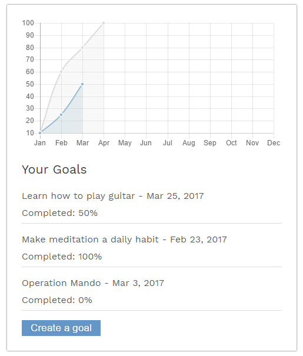

# Goal-Tracker

This is a MEAN (Mongo, Express, Angular, Node) based website that allows users to set goals and track them as well as their associated milestones.

*Created this site to get some experience with the MEAN Stack (still in progress)*

## Features
- Set and track high level goals
- Breakdown goals into manageable milestones
- Receive notifications via email / sms
- Monitor overall progress of all goals

### Screenshot - Goal Page

